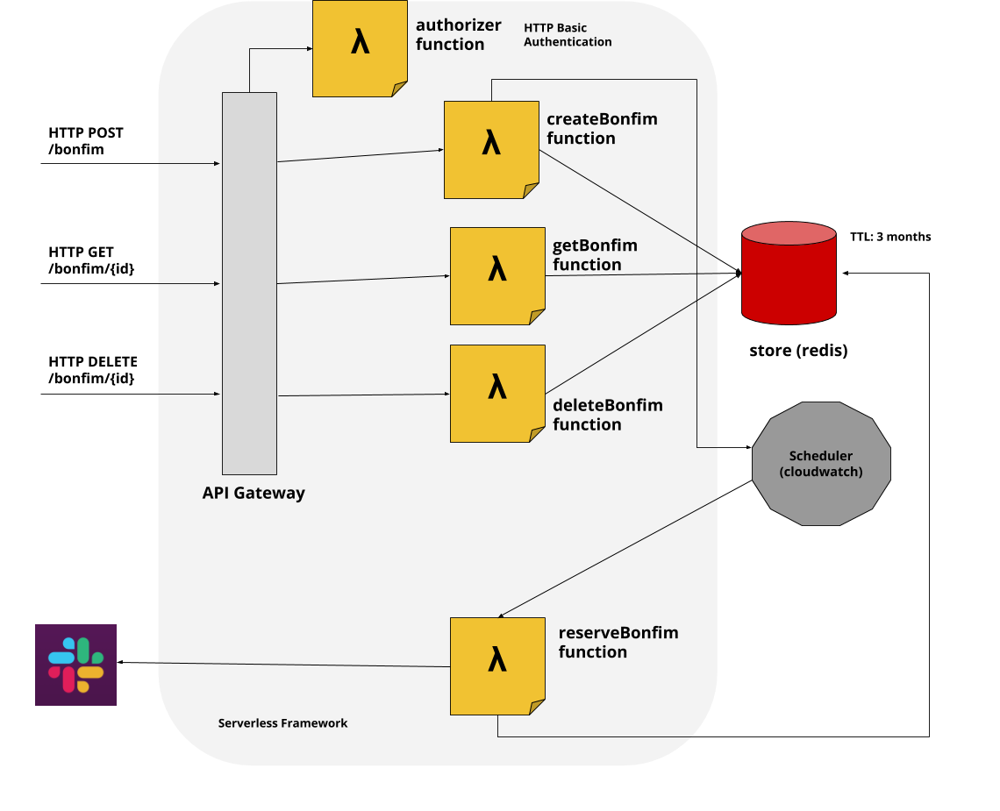

# agent
fixture reservations, one HTTP call away :soccer:

## architecture



## local development

### Prerequisites

| tools | remarks |
| --- | --- |
| [Docker](https://docs.docker.com/install/) | required |
| [nvm](https://github.com/nvm-sh/nvm) | for managing your Node JS environment |
| [Redis (_optional_)](https://redis.io/) | if you prefer running a Redis instance on host machine; else see docker-compose file |

### Install JS depedencies

First, make sure you are using the right Node JS environment.

```
nvm install  # should install the version specified in .nvmrc
nvm use
```
Then, simply install, and grab a cup of coffee while at it :coffee:.

```sh
npm install  # including dev dependencies
```

### Setup env vars

We provided sample env files in the names of `env-*.yml.sample`. You can copy these sample files, removing the `.sample` extension.

Please modify the environment variables accordingly.

### Running Serverless Offline

Because we require AWS API Gateway and Lambda functions (with [Serverless Framework](https://serverless.com/)), we can simply use the [Serverless Offline](https://github.com/dherault/serverless-offline) tool to simulate a 'local' API Gateway to invoke our Lambda functions via HTTP interface.

```sh
# NOTE: local server will be listening on port 3000
sls offline
```

### Setup and Run dependencies

```sh
# runs both Redis container and Swagger UI for API testing;
# Else, run the services individually if preferred
docker-compose up
```

#### Testing API endpoints locally

```sh
# using o'fashioned curl to create a fixture request
curl -H 'Authorization: Basic [username:password encoded in base64]'\
 -H 'Content-Type: application/json'\
  -X POST\
 -d '{"court": "outdoor", "date": "2020-12-32", "time": "1700-1900"}'\
 http://localhost:3000/bonfim\
  | jq ".id"
 # (optional) you can also pipe the response to jq and get the id
```

If a graphical UI is preferred instead, check out how to [test using Swagger UI](#Open_API_spec)

### Lint

We use Eslint for linting, and follow the now-classic [Airbnb Eslint config](https://www.npmjs.com/package/eslint-config-airbnb).

```sh
npm run lint
```

### Unit Tests

```sh
npm test
```

### Open API spec

Please see [here](docs/openapi.yml) for the API document (following OpenAPI 3.0).

For a more interactive experience with Swagger UI, you may like to:

```sh
docker-compose up openapi
```

and point to http://localhost:7777
